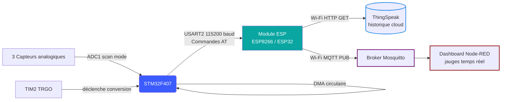

<div align="center">

# Acquisition IoT Cloud — STM32F407 & ESP8266/ESP32

### Acquisition ADC temps réel et supervision cloud multi-canal


`C bare-metal / HAL` · `ADC + DMA` · `Commandes AT` · `IoT Cloud`

</div>

---

## 📋 Vue d'ensemble

Système embarqué d'acquisition et de transmission de données IoT vers le cloud. Le STM32F407 échantillonne en continu trois canaux analogiques via **ADC en mode scan, déclenché par timer et géré en DMA circulaire** (aucune intervention CPU nécessaire pour l'acquisition), tandis qu'un module ESP (ESP8266/ESP32) pilote la connexion Wi-Fi et relaie les données vers **ThingSpeak** (historique cloud) et un **broker MQTT** (Mosquitto → dashboard Node-RED) via des commandes AT.

## ⚙️ Contributions clés

- 📡 Acquisition ADC multi-canaux (3 voies) déclenchée par timer, transférée en DMA sans blocage CPU
- 🌐 Intégration du module ESP (commandes AT) pour la connexion Wi-Fi et la communication HTTP/MQTT
- ☁️ Transmission des données vers ThingSpeak par requête HTTP GET
- 🔄 Publication en parallèle sur un broker MQTT local, visualisé en temps réel via Node-RED
- 🛠️ Configuration bas-niveau HAL : ADC+DMA, TIM2 (déclenchement de conversion), USART2 (liaison ESP)

## 🏗️ Architecture



## 🎥 Voir le système en action

### Dashboard Node-RED — jauges temps réel

<div align="center">
  
  <br><em>Visualisation temps réel des trois canaux ADC via Node-RED</em>
</div>

### ThingSpeak — historique cloud des trois canaux

<div align="center">
  
  <br><em>Historique cloud des valeurs ADC1/ADC2/ADC3 sur ThingSpeak</em>
</div>

### Trace série (HTerm) — trafic AT / MQTT / HTTP

<div align="center">
  
  <br><em>Séquence de commandes AT : publication MQTT (adc_1/2/3) puis requête HTTP GET vers ThingSpeak</em>
</div>

<div align="center">
  
  <br><em>Publication MQTT sur les topics dédiés + connexion IP directe au broker</em>
</div>

## 🔧 Matériel

| Composant | Rôle |
|---|---|
| STM32F407 | Acquisition ADC + traitement |
| Module ESP (ESP8266/ESP32) | Passerelle Wi-Fi (commandes AT) |
| 3 capteurs analogiques | Grandeurs mesurées (ADC_CHANNEL_10/11/12) |

## ⚡ Configuration clé

| Paramètre | Valeur |
|---|---|
| ADC | 12 bits, mode scan, 3 canaux, déclenché par TIM2 TRGO |
| DMA | Continu (circulaire), transfert sans intervention CPU |
| USART2 (liaison ESP) | 115200 bauds, réception non bloquante (`ReceiveToIdle_IT`) |
| Protocole cloud | HTTP GET vers `api.thingspeak.com` + MQTT vers broker Mosquitto |

## 💻 Code — Initialisation ADC + DMA (acquisition multi-canaux)

```c
hadc1.Instance = ADC1;
hadc1.Init.Resolution = ADC_RESOLUTION_12B;
hadc1.Init.ScanConvMode = ENABLE;
hadc1.Init.ExternalTrigConv = ADC_EXTERNALTRIGCONV_T2_TRGO; // déclenché par TIM2
hadc1.Init.DataAlign = ADC_DATAALIGN_RIGHT;
hadc1.Init.NbrOfConversion = 3;
hadc1.Init.DMAContinuousRequests = ENABLE;
HAL_ADC_Init(&hadc1);

// 3 canaux configurés en séquence (rank 1, 2, 3)
sConfig.Channel = ADC_CHANNEL_10; sConfig.Rank = 1;
HAL_ADC_ConfigChannel(&hadc1, &sConfig);
sConfig.Channel = ADC_CHANNEL_11; sConfig.Rank = 2;
HAL_ADC_ConfigChannel(&hadc1, &sConfig);
sConfig.Channel = ADC_CHANNEL_12; sConfig.Rank = 3;
HAL_ADC_ConfigChannel(&hadc1, &sConfig);

// Démarrage de l'acquisition en DMA circulaire, sans blocage CPU
HAL_ADC_Start_DMA(&hadc1, (uint32_t*)ADC_Value, 3);
```

## 💻 Code — Connexion Wi-Fi du module ESP (commandes AT)

```c
void ESP_Init_Station_Client(void) {
    HAL_UART_Transmit(ESP_UART, (uint8_t*)cmd_at_test, strlen(cmd_at_test), 1000);
    HAL_Delay(1000);

    HAL_UART_Transmit(ESP_UART, (uint8_t*)cmd_at_rst, strlen(cmd_at_rst), 1000);
    HAL_Delay(5000);

    HAL_UART_Transmit(ESP_UART, (uint8_t*)cmd_cwmode_1, strlen(cmd_cwmode_1), 1000);
    HAL_Delay(1000);

    sprintf(cmd_buffer, "AT+CWJAP=\"%s\",\"%s\"\r\n", WIFI_SSID, WIFI_PASS);
    HAL_UART_Transmit(ESP_UART, (uint8_t*)cmd_buffer, strlen(cmd_buffer), 10000);
    HAL_Delay(8000);
}
```

## 💻 Code — Transmission vers ThingSpeak (HTTP GET)

```c
void Transmission_Cloud_THINGSPEAK(void)
{
    sprintf(cmd_buffer, "AT+CIPSTART=\"TCP\",\"184.106.153.149\",80\r\n");
    HAL_UART_Transmit(ESP_UART, (uint8_t*)cmd_buffer, strlen(cmd_buffer), 1000);
    HAL_Delay(1000);

    sprintf(THINGSPEAK_REQUEST,
        "GET /update?api_key=%s&field1=%hu&field2=%hu&field3=%hu\r\n",
        APIKey, ADC_Value[0], ADC_Value[1], ADC_Value[2]);

    sprintf(cmd_buffer, "AT+CIPSEND=%d\r\n", strlen(THINGSPEAK_REQUEST));
    HAL_UART_Transmit(ESP_UART, (uint8_t*)cmd_buffer, strlen(cmd_buffer), 1000);
    HAL_Delay(500);

    HAL_UART_Transmit(ESP_UART, (uint8_t*)THINGSPEAK_REQUEST, strlen(THINGSPEAK_REQUEST), 1000);
    HAL_Delay(1000);
}
```

## 🚀 Build & Flash

1. Ouvrir le projet dans STM32CubeIDE
2. Renseigner tes identifiants Wi-Fi et ta clé API ThingSpeak dans le bloc `#define` en haut de `main.c`
3. Compiler en configuration Debug
4. Flasher la carte STM32F407 via ST-LINK
5. Observer les transmissions sur un terminal série (HTerm) branché sur le module ESP

## 🔭 Pistes d'amélioration

- **Passage en interruption/DMA côté ESP** : remplacer les délais fixes (`HAL_Delay`) après chaque commande AT par une détection réelle de réponse (`OK`, `>`) pour un échange plus robuste et plus rapide
- **Gestion des erreurs réseau** : détecter les échecs de connexion Wi-Fi ou de requête HTTP et relancer automatiquement au lieu de continuer en aveugle
- **Sécurisation de la clé API** : externaliser `APIKey` et les identifiants Wi-Fi hors du code source (fichier de config séparé, non versionné)
- **Passage à MQTT avec TLS** : chiffrer la liaison vers le broker pour un déploiement au-delà d'un réseau local de confiance
- **Historique local** : bufferiser quelques échantillons en cas de coupure Wi-Fi, pour éviter la perte de données entre deux tentatives de connexion

## 🛠 Tech Stack

`STM32F407` · `ESP8266/ESP32` · `C` · `ADC + DMA` · `USART` · `Commandes AT` · `MQTT (Mosquitto)` · `ThingSpeak` · `Node-RED` · `IoT`

## 📄 License

MIT
