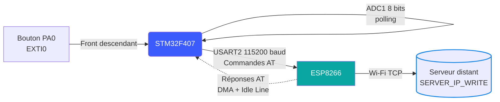

<div align="center">

# Acquisition IoT déclenchée par bouton — STM32F407 & ESP8266

### Mesure ADC ponctuelle et envoi vers un serveur distant via commandes AT


`IoT` · `Acquisition Événementielle` · `Communication Série DMA` · `Commandes AT`

</div>

---

## 📋 Vue d'ensemble

Système embarqué déclenché par bouton : une pression sur PA0 lance une acquisition ADC (8 bits, canal unique) puis transmet la valeur mesurée vers un serveur distant via un module ESP8266, piloté en commandes AT sur liaison série. La réception des réponses AT se fait par **DMA avec détection de ligne inactive (idle)**, ce qui permet de recevoir des trames de taille variable sans connaître leur longueur à l'avance.

## ⚙️ Contributions clés

- 🔘 Acquisition déclenchée par événement (interruption externe EXTI0, front descendant)
- 📊 Lecture ADC 8 bits par polling, sur un canal unique (`ADC_CHANNEL_1`)
- 📡 Pilotage complet de l'ESP8266 par commandes AT : reset, mode station, connexion Wi-Fi, connexion TCP, envoi de données
- 🔄 Réception série non bloquante par DMA, avec détection de fin de trame par ligne inactive (`HAL_UARTEx_ReceiveToIdle_DMA`)
- ⏱️ Cycle contrôlé : 15 secondes de pause après chaque envoi avant de pouvoir déclencher une nouvelle mesure

## 🏗️ Architecture



## 🔄 Cycle de fonctionnement

1. **Initialisation** : reset de l'ESP8266, test `AT`, passage en mode station (`CWMODE`), connexion au réseau Wi-Fi
2. **Attente** : la boucle principale reste bloquée tant que le bouton (`Exti0`) n'a pas été pressé
3. **Sur pression du bouton** :
   - Démarrage et lecture de l'ADC
   - Ouverture d'une connexion TCP (`CIPSTART`)
   - Formatage de la valeur mesurée et envoi (`CIPSEND` + données)
   - Fermeture de la connexion (`CIPCLOSE`)
   - Pause de 15 secondes avant de pouvoir redéclencher une mesure

## 🔧 Matériel

| Composant | Rôle |
|---|---|
| STM32F407VG | Acquisition ADC + pilotage ESP8266 |
| ESP8266 | Passerelle Wi-Fi (commandes AT) |
| Bouton poussoir (PA0) | Déclenchement manuel de la mesure |
| Capteur analogique (ADC_CHANNEL_1) | Grandeur mesurée |

## ⚡ Configuration clé

| Paramètre | Valeur |
|---|---|
| ADC | 8 bits, canal unique, conversion logicielle (polling) |
| EXTI0 | Front descendant, pull-down |
| USART2 (liaison ESP8266) | 115200 bauds |
| Réception | DMA avec détection de ligne inactive (idle) |
| Cycle | Pause bloquante de 15s après chaque transmission |

## 💻 Code — Boucle principale, déclenchement par bouton

```c
while (1)
{
    while (Exti0 == 0){}      // Attente du déclenchement bouton
    ESP8266_SendServer();     // Mesure + envoi vers le serveur
}
```

## 💻 Code — Mesure ADC et envoi au serveur

```c
void ESP8266_SendServer (void)
{
    HAL_ADC_Start(&hadc1);
    HAL_ADC_PollForConversion(&hadc1, 10);
    ADCVal = HAL_ADC_GetValue(&hadc1);
    HAL_ADC_Stop(&hadc1);

    ESP8266_SendCommand(__CIPSTART);   // Ouverture de la connexion TCP

    memset(BUFFER_TO_SEND, '\0', sizeof(BUFFER_TO_SEND));
    sprintf(BUFFER_TO_SEND, "%s=%d\r\n", __SERVER_IP_WRITE, ADCVal);
    sprintf((char*)__CIPSEND, "AT+CIPSEND=%d\r\n", strlen(BUFFER_TO_SEND));

    ESP8266_SendCommand(__CIPSEND);
    ESP8266_SendCommand((uint8_t*)&BUFFER_TO_SEND[0]);
    ESP8266_SendCommand(__CIPCLOSE);

    Exti0 = 0;
    HAL_Delay(15000);          // Pause avant la prochaine mesure
}
```

## 💻 Code — Réception série par DMA avec détection de ligne inactive

```c
void ESP8266_Receive (void)
{
    UART_DMA_DataIsReady = 0;
    memset(DMA_Buffer, '\0', sizeof(DMA_Buffer));
    // Reçoit jusqu'à détection d'une ligne inactive (fin de trame de taille variable)
    HAL_UARTEx_ReceiveToIdle_DMA(&huart2, (uint8_t*)DMA_Buffer, sizeof(DMA_Buffer));
}

void HAL_UARTEx_RxEventCallback(UART_HandleTypeDef *huart, uint16_t Size)
{
    memset(CPU_Buffer, '\0', sizeof(CPU_Buffer));
    memcpy(CPU_Buffer, DMA_Buffer, (DMAMAXCOUNTER - DMA1_Stream5->NDTR));
    ESP8266_Receive();          // Relance immédiatement l'écoute
    UART_DMA_DataIsReady = 1;
}
```

## 🚀 Build & Flash

1. Ouvrir le projet dans STM32CubeIDE
2. Renseigner `WIFI_NAME`, `WIFI_PASSWORD` et `__SERVER_IP_WRITE` dans les définitions du projet
3. Compiler en configuration Debug
4. Flasher la carte STM32F407 via ST-LINK
5. Appuyer sur le bouton (PA0) pour déclencher une mesure et un envoi

## 🔭 Pistes d'amélioration

- **Nettoyer les déclarations dupliquées** : plusieurs variables globales (`__CIPSEND`, `DMA_Buffer`, `hdma_adc1`, etc.) sont actuellement déclarées trois fois dans le fichier — à factoriser en une seule section `USER CODE BEGIN PV`
- **Anti-rebond matériel ou logiciel** sur le bouton EXTI0, pour éviter les déclenchements multiples sur un seul appui
- **Vérification des réponses AT** : actuellement le code attend un délai fixe puis considère la donnée "prête" — ajouter une vérification du contenu (`OK`, `ERROR`) pour détecter les échecs de connexion
- **ADC en 12 bits** : passer de 8 à 12 bits de résolution pour une meilleure précision de mesure
- **Suppression du délai bloquant de 15s** : le remplacer par un timer non bloquant pour garder le système réactif pendant l'attente
- **Sécurisation des identifiants Wi-Fi** : les externaliser du code source

## 🛠 Tech Stack

`STM32F407` · `ESP8266` · `C` · `ADC` · `USART + DMA` · `EXTI` · `Commandes AT` · `IoT`
